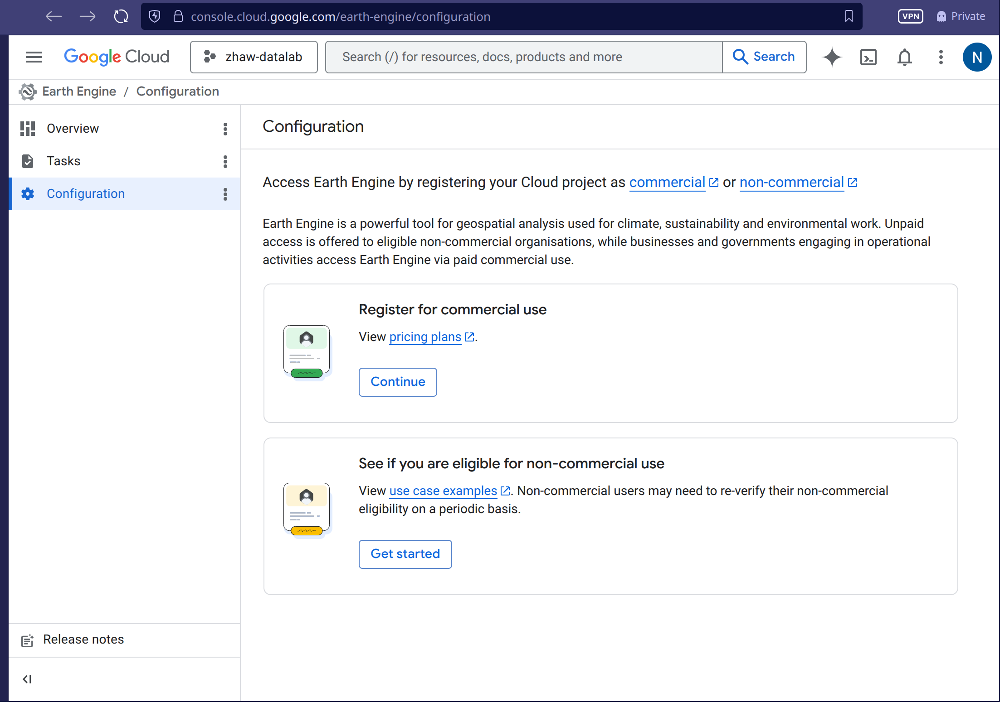
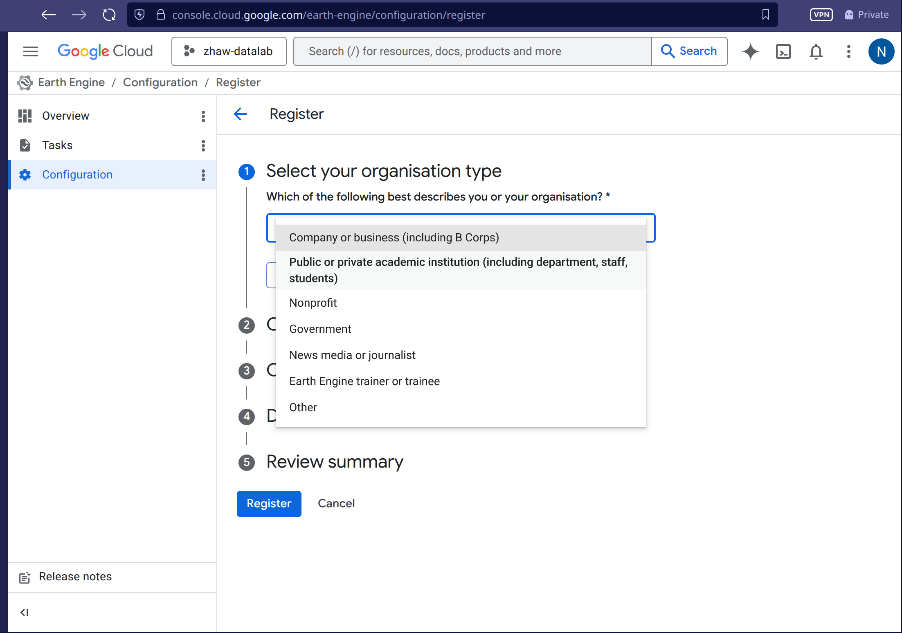
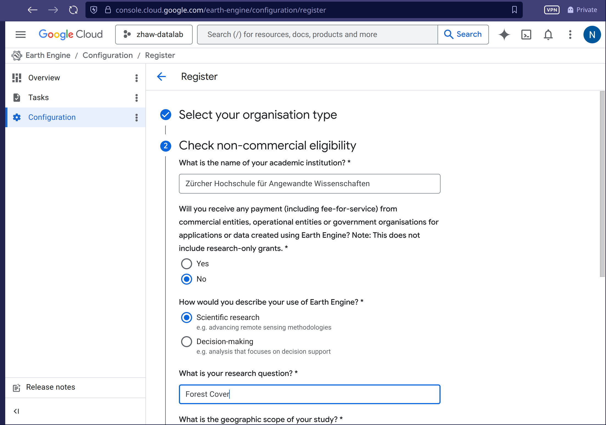
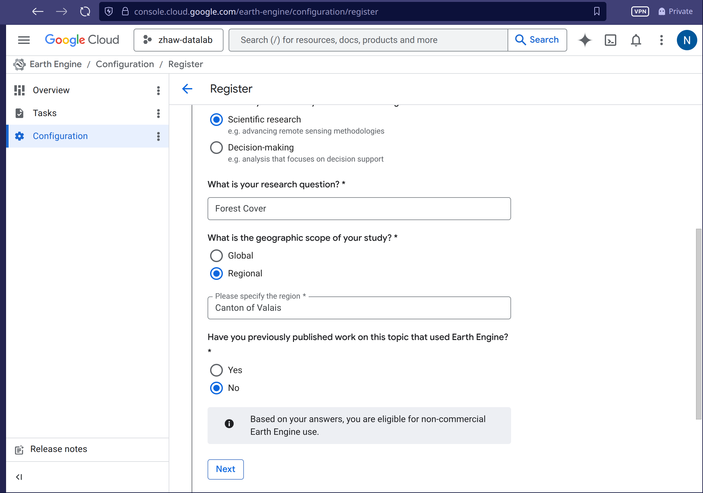
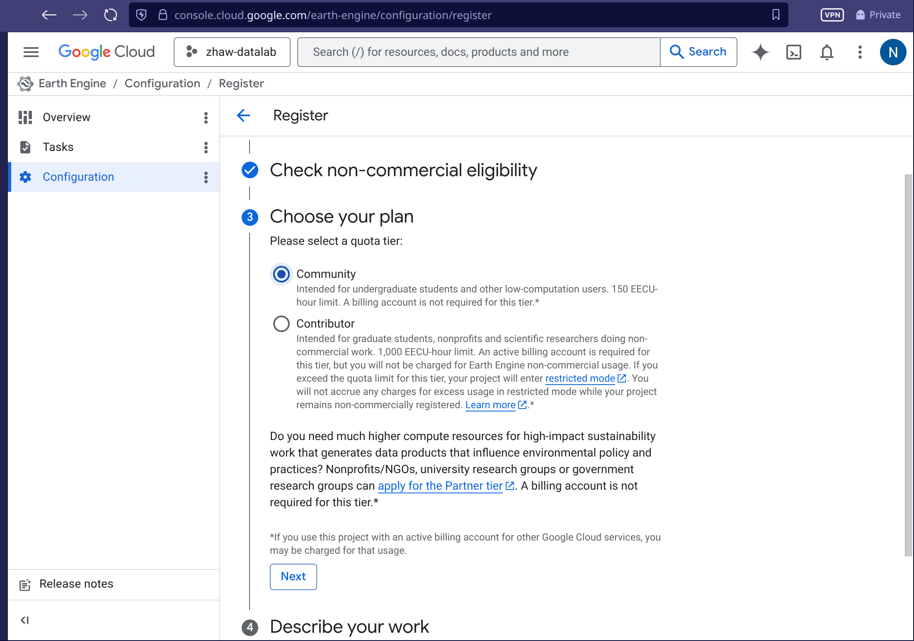
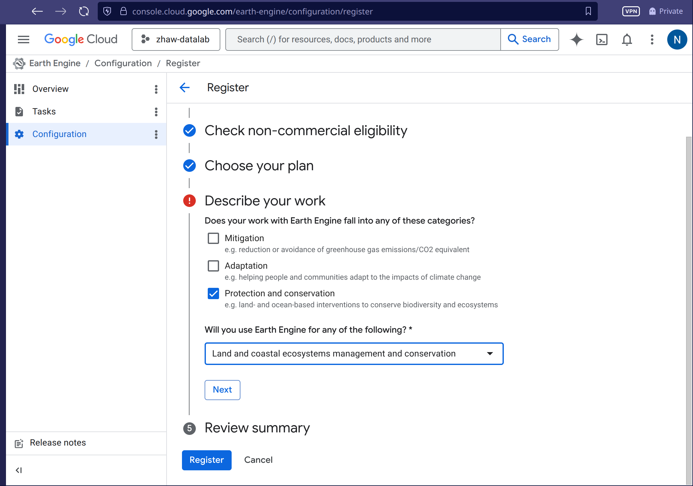
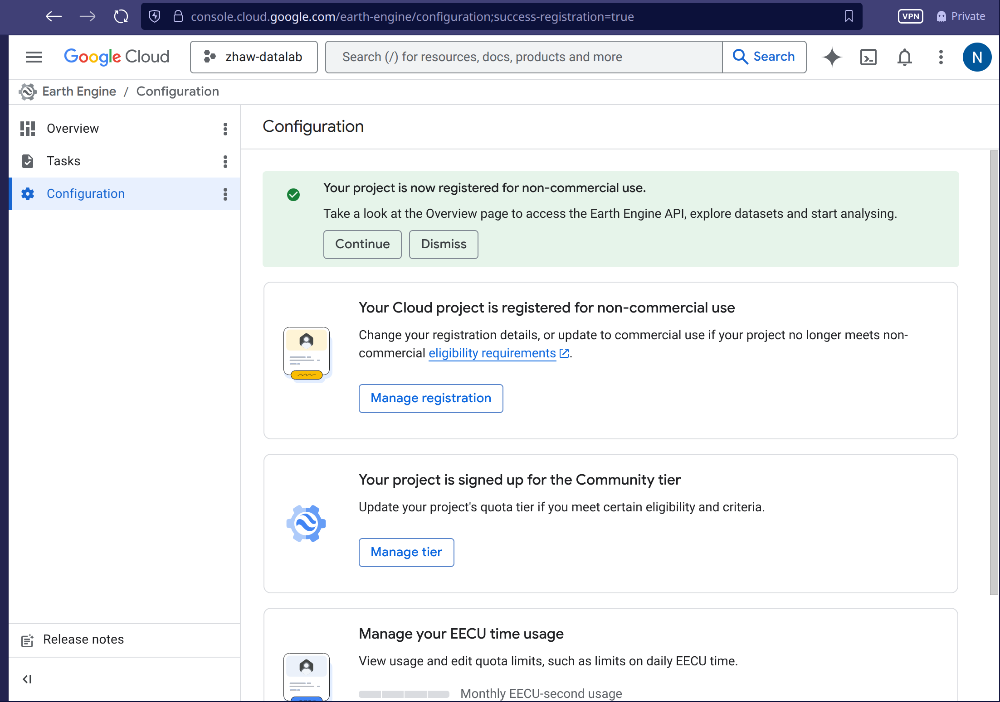
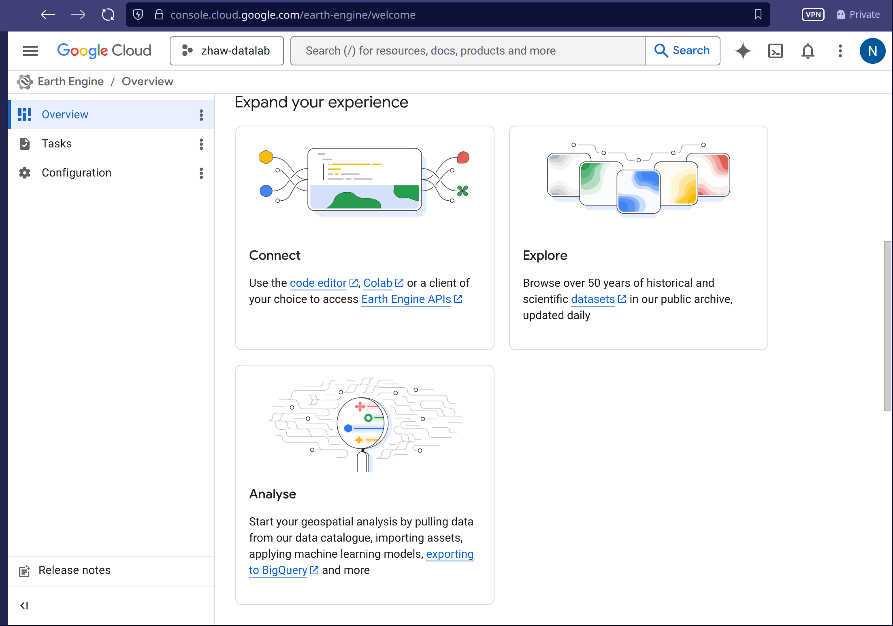

# Register Google Earth Engine

Google Earth Engine (GEE) is a cloud-based platform for geospatial analysis. To use it in the course *Remote Sensing and Geodata Acquisition*, you need to register a project for non-commercial use.

**Prerequisites:** A Google account (personal or institutional).

:::{.column-screen}

 and login with your google account. Choose *I want to register a new product*](images/Register-01.png){#fig-01}

{#fig-02}

{#fig-03}

{#fig-04}

{#fig-05}

{#fig-06}

{#fig-07}

{#fig-08}

{#fig-09}

, your username should be blue, and not orange with a warning. If it is still orange, wait a few minutes and refresh — approval is usually instant but can take up to an hour.](images/Register-10.png){#fig-10}

:::